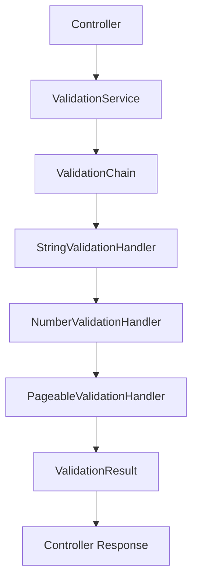

# Princípios de Design e Sistema de Validações

## 📋 Visão Geral

Este documento explica como o Sistema de Créditos implementa os princípios fundamentais de design de software (KISS, DRY, SOLID) e como funciona o sistema de validações.

---

## 🎯 Princípio KISS (Keep It Simple, Stupid)

### Como o Sistema Implementa KISS

#### ✅ **Controllers Simples e Diretos**
```java
@RestController
@RequestMapping("/api")
public class PingController {
    @GetMapping("/ping")
    public Map<String, Object> ping() {
        return Map.of(
            "message", "pong",
            "ts", Instant.now().toString()
        );
    }
}
```
- **Simplicidade**: Endpoint direto sem complexidade desnecessária
- **Clareza**: Retorno simples e compreensível

#### ✅ **Entidades Focadas**
```java
@Entity
@Table(name = "credito")
public class Credito {
    // Apenas dados e métodos básicos
    // Lógica de negócio movida para serviços
}
```
- **Responsabilidade Única**: Entidade apenas armazena dados
- **Sem Complexidade**: Sem lógica de negócio desnecessária

#### ✅ **Tratamento de Exceções Simplificado**
```java
@ExceptionHandler(CreditoException.class)
public ResponseEntity<Map<String, Object>> handleCreditoException(CreditoException ex) {
    Map<String, Object> errorResponse = new HashMap<>();
    errorResponse.put("timestamp", Instant.now().toString());
    errorResponse.put("status", ex.getHttpStatus());
    errorResponse.put("message", ex.getMessage());
    return ResponseEntity.status(ex.getHttpStatus()).body(errorResponse);
}
```
- **Estrutura Consistente**: Resposta de erro padronizada
- **Informações Essenciais**: Apenas dados necessários

#### ⚠️ **Áreas de Melhoria**
- `PageableValidationHandler` (213 linhas) poderia ser quebrado em métodos menores
- Algumas validações complexas poderiam ser simplificadas

---

## 🔄 Princípio DRY (Don't Repeat Yourself)

### Como o Sistema Implementa DRY

#### ✅ **Reutilização de Serviços**
```java
@Service
public class ValidationService {
    // Serviço centralizado para todas as validações
    public String validateStringInput(String input, String fieldName) {
        // Lógica reutilizada em múltiplos controllers
    }
}
```

#### ✅ **Chain of Responsibility para Validações**
```java
@Component
public class ValidationChain {
    // Cadeia reutilizável para diferentes tipos de validação
    public ValidationResult validateStringNotEmpty(Object value, String fieldName) {
        // Lógica centralizada
    }
}
```

#### ❌ **Violações Identificadas**

1. **Duplicação de Constantes**
```java
// Em ValidationService.java
private static final Set<String> VALID_SORT_FIELDS = Set.of(
    "id", "numeroCredito", "numeroNfse", "dataConstituicao", 
    "valorIssqn", "tipoCredito", "simplesNacional", "aliquota", 
    "valorFaturado", "valorDeducao", "baseCalculo"
);

// Em PageableValidationHandler.java (DUPLICADO)
private static final Set<String> VALID_SORT_FIELDS = Set.of(
    "id", "numeroCredito", "numeroNfse", "dataConstituicao", 
    "valorIssqn", "tipoCredito", "simplesNacional", "aliquota", 
    "valorFaturado", "valorDeducao", "baseCalculo"
);
```

2. **Lógica de Parsing Repetida**
```java
// Lógica similar em múltiplos handlers
if (value instanceof Number) {
    return ((Number) value).intValue();
} else if (value instanceof String) {
    try {
        return Integer.parseInt((String) value);
    } catch (NumberFormatException e) {
        return error("Parâmetro deve ser um número", fieldName);
    }
}
```

---

## 🏗️ Princípios SOLID

### 1. Single Responsibility Principle (SRP) - ✅ EXCELENTE

#### **Separação Clara de Responsabilidades**

```java
// Controller: Apenas coordenação
@RestController
public class CreditoController {
    public ResponseEntity<Credito> buscarCreditoPorNumero(String numeroCredito) {
        validationService.validateStringInput(numeroCredito, "Número do crédito");
        Credito credito = creditoService.buscarCreditoPorNumero(numeroCredito);
        return ResponseEntity.ok(credito);
    }
}

// Service: Lógica de negócio
@Service
public class CreditoServiceImpl implements CreditoService {
    public Credito buscarCreditoPorNumero(String numeroCredito) {
        validationService.validateStringInput(numeroCredito, "Número do crédito");
        return creditoRepository.findByNumeroCredito(numeroCredito);
    }
}

// Repository: Acesso a dados
public interface CreditoRepository extends JpaRepository<Credito, Long> {
    Credito findByNumeroCredito(String numeroCredito);
}
```

### 2. Open/Closed Principle (OCP) - ✅ BOM

#### **Extensibilidade sem Modificação**

```java
public abstract class AbstractValidationHandler implements ValidationHandler {
    protected ValidationHandler next;
    
    public void setNext(ValidationHandler next) {
        this.next = next;
    }
    
    public ValidationResult handle(ValidationRequest request) {
        if (canHandle(request)) {
            return doHandle(request);
        } else if (next != null) {
            return next.handle(request);
        }
        return error("Nenhum handler pode processar a requisição", request.getFieldName());
    }
    
    protected abstract boolean canHandle(ValidationRequest request);
    protected abstract ValidationResult doHandle(ValidationRequest request);
}
```

**Benefícios:**
- Novos handlers podem ser adicionados sem modificar código existente
- Cadeia de validação é extensível

### 3. Liskov Substitution Principle (LSP) - ✅ BOM

#### **Implementações Intercambiáveis**

```java
// Qualquer implementação de ValidationHandler pode substituir outra
@Component
public class StringValidationHandler extends AbstractValidationHandler {
    // Implementação específica
}

@Component
public class NumberValidationHandler extends AbstractValidationHandler {
    // Implementação específica
}

// Todas podem ser usadas na ValidationChain
```

### 4. Interface Segregation Principle (ISP) - ✅ BOM

#### **Interfaces Específicas e Focadas**

```java
public interface ValidationHandler {
    boolean canHandle(ValidationRequest request);
    ValidationResult handle(ValidationRequest request);
    String getHandlerName();
    int getPriority();
}

public interface CreditoService {
    Credito buscarCreditoPorNumero(String numeroCredito);
    List<Credito> buscarCreditosPorNfse(String numeroNfse);
    PaginatedCreditoResponse buscarCreditosPorNfseComPaginacao(String numeroNfse, Pageable pageable);
}
```

### 5. Dependency Inversion Principle (DIP) - ✅ EXCELENTE

#### **Dependência de Abstrações**

```java
@Service
public class CreditoServiceImpl implements CreditoService {
    private final CreditoRepository creditoRepository;
    private final ValidationService validationService;
    private final TestDataGeneratorService testDataGeneratorService;
    
    // Injeção de dependências via construtor
    public CreditoServiceImpl(CreditoRepository creditoRepository,
                            ValidationService validationService,
                            TestDataGeneratorService testDataGeneratorService) {
        this.creditoRepository = creditoRepository;
        this.validationService = validationService;
        this.testDataGeneratorService = testDataGeneratorService;
    }
}
```

**Benefícios:**
- Fácil teste unitário com mocks
- Baixo acoplamento entre classes
- Flexibilidade para trocar implementações

---

## 🔍 Sistema de Validações

### Arquitetura do Sistema de Validações

O sistema utiliza o padrão **Chain of Responsibility** para organizar validações de forma flexível e extensível.

#### **Componentes Principais**

1. **ValidationChain**: Orquestrador da cadeia
2. **ValidationHandler**: Interface para handlers
3. **AbstractValidationHandler**: Classe base abstrata
4. **Handlers Específicos**: Implementações para diferentes tipos de validação

#### **Fluxo de Validação**



#### **Tipos de Validação Suportados**

1. **Validação de Strings**
   ```java
   public ValidationResult validateStringNotEmpty(Object value, String fieldName)
   public ValidationResult validateStringOptional(Object value, String fieldName)
   ```

2. **Validação de Números**
   ```java
   public ValidationResult validatePositiveNumber(Object value, String fieldName)
   public ValidationResult validateNumberRange(Object value, String fieldName, int min, int max)
   ```

3. **Validação de Paginação**
   ```java
   public ValidationResult validateAndCreatePageable(int page, int size, String sortBy, String sortDirection)
   ```

#### **Exemplo de Uso**

```java
@GetMapping("/paginated/{numeroNfse}")
public ResponseEntity<PaginatedCreditoResponse> buscarCreditosPorNfseComPaginacao(
        @PathVariable String numeroNfse,
        @RequestParam(defaultValue = "0") int page,
        @RequestParam(defaultValue = "10") int size,
        @RequestParam(defaultValue = "dataConstituicao") String sortBy,
        @RequestParam(defaultValue = "desc") String sortDirection) {
    
    // Validação da string
    validationService.validateStringInput(numeroNfse, "Número da NFS-e");
    
    // Validação e criação do Pageable
    Pageable pageable = validationService.validateAndCreatePageable(page, size, sortBy, sortDirection);
    
    // Busca dos dados
    PaginatedCreditoResponse response = creditoService.buscarCreditosPorNfseComPaginacao(numeroNfse, pageable);
    
    return ResponseEntity.ok(response);
}
```

#### **Vantagens do Sistema de Validações**

1. **Extensibilidade**: Novos tipos de validação podem ser adicionados facilmente
2. **Reutilização**: Validações podem ser reutilizadas em diferentes contextos
3. **Manutenibilidade**: Cada tipo de validação tem sua própria classe
4. **Testabilidade**: Cada handler pode ser testado independentemente
5. **Flexibilidade**: Ordem de validação pode ser configurada por prioridade

#### **Tratamento de Erros**

```java
public class ValidationResult {
    private boolean valid;
    private String message;
    private String fieldName;
    private Object processedValue;
    
    public static ValidationResult success(String message, String fieldName, Object value) {
        return new ValidationResult(true, message, fieldName, value);
    }
    
    public static ValidationResult error(String message, String fieldName) {
        return new ValidationResult(false, message, fieldName, null);
    }
}
```

---

## 📊 Avaliação Geral

| Princípio | Nota | Status |
|-----------|------|--------|
| **KISS** | 8/10 | ✅ Bom |
| **DRY** | 6/10 | ⚠️ Precisa Melhorar |
| **SOLID** | 9/10 | ✅ Excelente |

### Pontos Fortes
- Arquitetura bem estruturada
- Separação clara de responsabilidades
- Sistema de validações flexível e extensível
- Boa testabilidade
- Tratamento robusto de exceções

### Áreas de Melhoria
- Eliminar duplicações de código
- Simplificar algumas validações complexas
- Centralizar constantes e utilitários

---

## 🚀 Próximos Passos

Consulte o arquivo `TAREFAS_DRY.md` para uma lista detalhada de tarefas para melhorar o princípio DRY e elevar a nota de 6/10 para 9/10.
